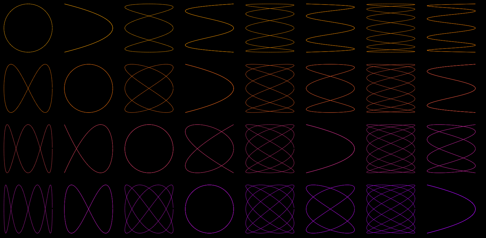
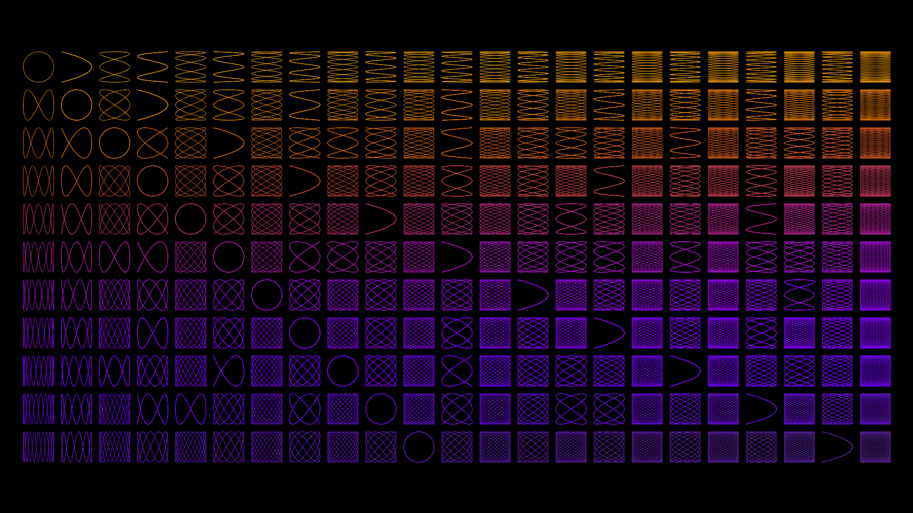

# lissoujas

A Lissoujas curve can be created with a parametric sine function that does not have equal periods. 

    Example: f(t) = <3*cos(t), 5*sin(t)>.

## Live demo

[Lissoujas curves](https://darkeclipz.github.io/lissoujas/)

[Lissoujas curves (static - stops after a cycle)](https://darkeclipz.github.io/lissoujas/index_static.html)

## Screenshots

## Credit

[Coding Challenge #116: Lissajous Curve Table](https://www.youtube.com/watch?v=--6eyLO78CY)
